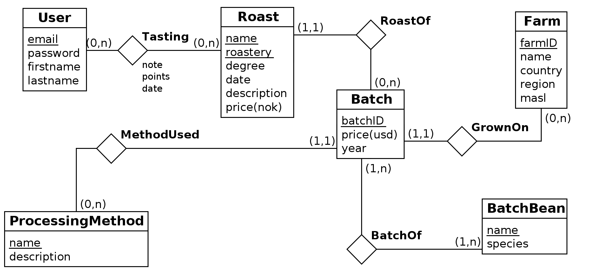

# Assignment assumptions
- A user can only have one tasting of a roast
- A bean species cannot grow on a farm without being part of a batch
- Beans from different species can not have the same name

# ER-Model

